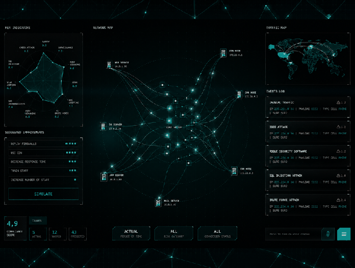

  

  

  🛡️ <b>Focus:</b> Operational Security • Infrastructure Hardening • Scripting
   
  ✨ Curious mind · 🌱 Lifelong learner · 💻 Cyber Security & IA enthusiast 

  🌐 Mon Site - Transition Professionnelle vers l'IT →
  <a href="https://www.briadev.com/" target="_blank"><b>briadev.com</b></a>

 

<h2 align="center">🛡️ Cybersecurity & Defensive Tools</h2>

  
  
  
  
  
  

  

<h2 align="center">⚙️ Systems, Cloud & Infra</h2>

  

<h2 align="center">🛠️ Development & Automation</h2>

  

 

<h2 align="center">🌐 Connect with me</h2>

  &nbsp;
  &nbsp;
  

 
